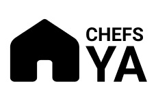

<!-- PROJECT LOGO -->
 

  
   

    Para visitar el proyecto dirigete a:
     
    <a href="https://www.chefsya.xyz"><strong>www.chefsya.xyz</strong></a>
     
  
    
  

  

<!-- TABLE OF CONTENTS -->

  
Table of Contents

  <ol>
    <li>
      <a href="#about-the-project">About The Project</a>
      <ul>
        <li><a href="#built-with">Built With</a></li>
      </ul>
    </li>
    <li>
      <a href="#getting-started">Getting Started</a>
      <ul>
        <li><a href="#prerequisites">Prerequisites</a></li>
        <li><a href="#installation">Installation</a></li>
      </ul>
    </li>
    <li><a href="#usage">Usage</a></li>
    <li><a href="#roadmap">Roadmap</a></li>
    <li><a href="#contributing">Contributing</a></li>
    <li><a href="#license">License</a></li>
    <li><a href="#contact">Contact</a></li>
   
  </ol>

<!-- ABOUT THE PROJECT -->
## About The Project

ChefsYA! Es una app donde tu puedes contratar un chef de tu zona geográfica, para que vaya y cocine en la comodidad de tu hogar. Es muy simple, solo buscas que quieres comer, y filtras los chefs que tengan en su menú eso que tu quieres comer, luego eliges en función de su CV, zona geográfica y precios de sus platos, reservas, pagas y listo.

(<a href="#top">back to top</a>)

### Built With

This section should list any major frameworks/libraries used to bootstrap your project. Leave any add-ons/plugins for the acknowledgements section. Here are a few examples.

(<a href="#top">back to top</a>)

## Usage

En este apartado describimos todas las users stories que incluye chefsya:

- 1) Un usuario puede ingresar al home de CHefsYa!
- 2) Un usuario puede ver (contact us, about us. ayuda)
- 3) Un usuario puede ver los mejores chef (mas alto raitin)
- 4) Un usario puede ver el "Como funciona"
- 5) Un usuario puede buscar chefs con sus filtros
- 6) Un usuario puede ver un chef en particular
- 7) Un usuario pued ver platos de ese chef
- 8) Un usuario puede crear una reserva
- 9) Un cocinero puede ver su dashboard
- 10) Un cocinero puede ver sus platos
- 11) Un cocinero puede crear nuevos platos
- 12) Un cocinero puede actualizar los platos
- 13) Un cocinero puede ver las reservas

(<a href="#top">back to top</a>)

<!-- CONTACT -->
## Contact

Your Name - [@your_twitter](https://twitter.com/cmanuferrer

Project Link: [https://github.com/puzzle404/ChefsYa](https://github.com/puzzle404/ChefsYa)

(<a href="#top">back to top</a>)

<!-- ACKNOWLEDGMENTS -->
